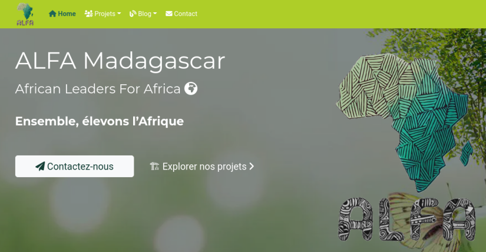

# [ALFA Madagascar website made with Hugo](https://github.com/alidipatrick/alfa-hugo)

ALFA est l’acronyme de African Leaders For Africa.

Il s’agit d’une initiative né en juillet 2019 par les jeunes issus du programme YALI (Young African Leadership Initiative), de la promotion 9, qui vise à atteindre tous les leaders panafricains en Afrique et dans le monde pour agir ensemble pour le développement de l’Afrique. Plus tard, l’équipe s’est alliée avec des professionnels pour former le bureau exécutif.